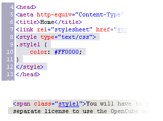
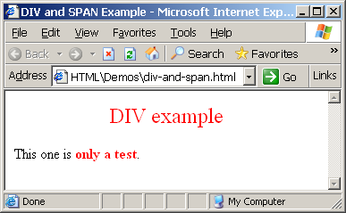
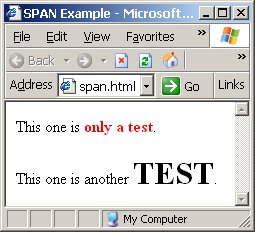
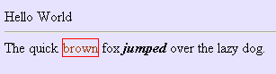

<!-- section start -->
<!-- attr: { id:'', class:'slide-title', showInPresentation:'True', hasScriptWrapper:'True', style:'font-size: 42px' } -->
# HTML 5
## The past, the present, the future


<!-- section start -->
<!-- attr: { id:'', class:'', showInPresentation:'True', hasScriptWrapper:'True', style:'font-size: 42px' } -->
# Table of Contents
- Hypertext Markup Language
- HTML Concepts
- HTML Document Structure
- HTML Common Elements
- Section Elements
- Semantic Structural Tags


<!-- section start -->
<!-- attr: { id:'', class:'slide-section', showInPresentation:'True', hasScriptWrapper:'True', style:'font-size: 42px' } -->
# Hypertext Markup Language


<!-- attr: { id:'', class:'', showInPresentation:'True', hasScriptWrapper:'False', style:'font-size: 42px' } -->
# Hypertext Markup Language
- HTML – **H**yper **T**ext **M**arkup **L**anguage
  - A notation for describing
    - **document structure** (semantic markup)
    - **formatting** (presentation markup)
  - Looks (looked?) like:
    - A Microsoft Word document
- The markup tags provide information about the page content structure
- A HTML document consists of many tags


<!-- attr: { id:'', class:'', showInPresentation:'True', hasScriptWrapper:'False', style:'font-size: 42px' } -->
# Creating HTML Pages
- An HTML document must have an **.htm** or **.html** file extension
- HTML files can be created with text editors:
  - _Note_pad, _Note_pad++, Sublime Text
- Or HTML editors (WYSIWYG Editors):
  - Microsoft WebMatrix
  - Microsoft Expression Web
  - Microsoft Visual Studio
  - Adobe Dreamweaver


<!-- attr: { id:'', class:'', showInPresentation:'True', hasScriptWrapper:'True', style:'font-size: 38px' } -->
# HTML – Past, Present, Future
- 1991 – HTML first mentioned – Tim Berners-Lee – HTML tags
- 1993 – HTML (first public version, published at IETF)
- 1993 – HTML 2 draft
- 1995 – HTML 2 – W3C
- 1995 – HTML 3 draft 
- 1997 – HTML 3.2 – “Wilbur”
- 1997 – HTML 4 – ”Cougar” – CSS 
- 1999 – HTML 4.01 (final)
- 2000 – XHTML draft 
- 2001 – XHTML  (final)
- 2008 – HTML5 / XHTML5 draft
- 2011 – feature complete HTML5
- http://en.wikipedia.org/wiki/HTML5#Plan_2014


<!-- section start -->
<!-- attr: { id:'', class:'slide-section', showInPresentation:'True', hasScriptWrapper:'True', style:'font-size: 42px' } -->
# HTML Terminology
## Tags, Attributes and Elements


<!-- attr: { id:'', class:'', showInPresentation:'True', hasScriptWrapper:'False', style:'font-size: 42px' } -->
# HTML Terminology
- Concepts in HTML
  - Tags
    - Opening tag and closing tag
    - The smallest piece in HTML
  - Attributes
    - Properties of the tag
    - Size, color, etc… 
  - Elements
    - Combination of opening, closing tag and attributes


<!-- attr: { id:'', class:'', showInPresentation:'True', hasScriptWrapper:'True', style:'font-size: 42px' } -->
# HTML Tags
- Tags are the smallest piece in HTML Document
  - Start with "**&#60;**" and end with "**&#62;**"
- Two kinds of tags
  - Opening
    - Mark the start of an HTML element
  - Closing
    - Mark the end of an HTML element
    - Start in "**&#60;/**"

```html
<html>
<body>
   <h1>Hello Pesho!</h1>
</body>
</html>
```

<div class="fragment balloon" style="top:68%; left:17%; width:25.56%">Opening tags</div>

<div class="fragment balloon" style="top:82%; left:17%; width:25.56%">Closing tags</div>


<!-- attr: { id:'', class:'', showInPresentation:'True', hasScriptWrapper:'True', style:'font-size: 42px' } -->
# Attributes
- Attributes are properties of HTML Elements
  - Used to set size, color, border, etc…
  - Put directly in the tags
  - Has value surrounded by **" "** or**' '**
    - The value is always a string

```html
<!-– makes a hyperlink to Google -->
<a href="http://google.com"> go to Google</a>
<!-– makes a horizontal line -->
<hr width="95%" size="3px"/>
<!-– adds an image in the web page -->

```

<div class="fragment balloon" style="top:55%; left:65%; width:25.56%">Some  tags don't have closing tag</div>


<!-- attr: { id:'', class:'', showInPresentation:'True', hasScriptWrapper:'False', style:'font-size: 42px' } -->
# Most Common Attributes
- There are some attributes that are common for every HTML element
  - Id, class, name, style
- And some attributes are specific
  - For example the attribute **src** of the **img** element
    - Shows the path to the image to be shown


<!-- attr: { id:'', class:'', showInPresentation:'True', hasScriptWrapper:'False', style:'font-size: 42px' } -->
# HTML Elements
- **HTML Elements** are combination of tags and attributes
  - Opening tag with some or none attributes and a closing tag

```html
<a href="http://google.com"> go to Google</a>
```


```html
<html>…</html>
```


<!-- attr: { id:'', class:'slide-section demo', showInPresentation:'True', hasScriptWrapper:'True', style:'font-size: 42px' } -->
# HTML Terminology
## [Live Demo]()


<!-- section start -->
<!-- attr: { id:'', class:'slide-section', showInPresentation:'True', hasScriptWrapper:'True', style:'font-size: 42px' } -->
# HTML Document Structure
## HTML Document, Doctype, Head, Body


<!-- attr: { id:'', class:'', showInPresentation:'True', hasScriptWrapper:'False', style:'font-size: 42px' } -->
# HTML Document Structure
- Some elements are essential to each HTML Document:
    - **html**, **head**, **body**, **doctype**
- The **html** element
  - Used to mark the beginning and ending of a HTML document
  - All the content of the web page is inside this tag

```html
<html>
    …
</html>
```


<!-- attr: { id:'', class:'', showInPresentation:'True', hasScriptWrapper:'True', style:'font-size: 42px' } -->
# Head Element
- The **head** tag contains markup that is not visible to the user (i.e. the person using the browser)
  - But helps the browser to render correctly the HTML document
- What is in there?
  - Styles, scripts
  - Declare encodings
  - Etc..
  - The **title** tag - the text in the tab of a browser


<!-- attr: { id:'', class:'', showInPresentation:'True', hasScriptWrapper:'False', style:'font-size: 42px' } -->
# Body Element and Doctype
- **body** element contains all the visible to the user markup
  - Headings, text, hyperlinks, images, etc…
  - Textboxes, sliders, buttons…
- **Doctype** is kind of the validator of the page
  - Tells the browser in which version of HTML the page is written
  - HTML 5 Doctype

```html
<!DOCTYPE html>
```


<!-- attr: { id:'', class:'slide-section demo', showInPresentation:'True', hasScriptWrapper:'True', style:'font-size: 42px' } -->
# HTML Document Structure
## [Live Demo]()


<!-- section start -->
<!-- attr: { id:'', class:'', showInPresentation:'True', hasScriptWrapper:'False', style:'font-size: 42px' } -->
# Text Formatting
- Text formatting tags modify the text between the opening tag and the closing tag
  - Ex. **&#60;b>Hello</b&#62;** makes "Hello" bold
  - Many of the formatting tags are deprecated
    - Use CSS instead

<!-- attr: { id:'', class:'', showInPresentation:'True', hasScriptWrapper:'False', style:'font-size: 40px' } -->
# Text Formatting

| Tags | Meaning |
|:---- |:-------:|
| &#60;b&#62;&#60;/b&#62;  | <b>bold</b>    |
| &#60;i&#62;&#60;/i&#62;  | <i>italiazed</i>    |
| &#60;u&#62;&#60;/u&#62;  | <u>underlined</u>    |
| &#60;sup&#62;&#60;/sup&#62;  | sample<sup>superscript</sup>    |
| &#60;sub&#62;&#60;/sub&#62;  | sample<sub>bold</sub>    |
| &#60;strong&#62;&#60;/strong&#62;  | <strong>strong</strong>    |
| &#60;em&#62;&#60;/em&#62;  | <em>emphasized</em>    |
| &#60;pre&#62;&#60;/pre&#62;  | <pre>preformatted text</pre>   |

<!-- attr: { id:'', class:'', showInPresentation:'True', hasScriptWrapper:'False', style:'font-size: 42px' } -->
# Some Simple Tags
- Hyperlink Tags

```html
<a href="http://www.telerik.com/"
  title="Telerik">Link to Telerik Web site</a>
```
- Image Tags

```html

```
- Text formatting tags

```html
This text is <em>emphasized.</em>
<br />new line<br />
This one is <strong>more emphasized.</strong>
```


<!-- attr: { id:'', class:'', showInPresentation:'True', hasScriptWrapper:'False', style:'font-size: 42px' } -->
# Headings and Paragraphs
- Heading Tags (h1 – h6)

```html
<p>This is my first paragraph</p>
<p>This is my second paragraph</p>
```
- Paragraph Tags

```html
<h1>Heading 1</h1>
<h2>Sub heading 2</h2>
<h3>Sub heading 3</h3>
```
- Sections: **div** and **span**


```html
<div style="background: skyblue;">
   This is a div</div>
```


<!-- attr: { id:'', class:'', showInPresentation:'True', hasScriptWrapper:'False', style:'font-size: 42px' } -->
# Ordered Lists: <ol> Tag
- Create an **O**rdered **L**ist using **&#60;ol></ol&#62;**:

```html
<ol type="1">
  <li>Apple</li>
  <li>Orange</li>
  <li>Grapefruit</li>
</ol>
```
- Attribute values for **type** are **1**, **A**, **a**, **I**, or **i**


<!-- attr: { id:'', class:'', showInPresentation:'True', hasScriptWrapper:'False', style:'font-size: 40px' } -->
# Unordered Lists: <ul> Tag
- Create an **Unordered List** using **&#60;ul></ul&#62;**:
- Attribute values for **type** are:
  - 


<!-- attr: { id:'', class:'', showInPresentation:'True', hasScriptWrapper:'False', style:'font-size: 42px' } -->
# Definition lists: **&#60;dl&#62;** tag
- Create definition lists using **&#60;dl&#62;**
  - Pairs of text and associated definition; text is in **&#60;dt&#62;** tag, definition in **&#60;dd&#62;** tag
  - Renders without bullets
  - Definition is indented

```html
<dl>
  <dt>HTML</dt>
  <dd>A markup language …</dd>
  <dt>CSS</dt>
  <dd>Language used to …</dd>
</dl>
```

<!-- attr: { id:'', class:'slide-section demo', showInPresentation:'True', hasScriptWrapper:'True', style:'font-size: 42px' } -->
# HTML Common Elements
## Live Demo

<!-- section start -->
<!-- attr: { id:'', class:'slide-section', showInPresentation:'True', hasScriptWrapper:'True', style:'font-size: 42px' } -->
# Section Elements
## The **&#60;div&#62;** and The **&#60;span&#62;**




<!-- attr: { id:'', class:'', showInPresentation:'True', hasScriptWrapper:'True', style:'font-size: 42px' } -->
# The <div> Tag
- &#60;div&#62; creates logical divisions within a page <!-- .element: style="width: 60%" --> 
  - Block element
  - Used with CSS
  
- _Example_:

```html
<div style="font-size:24px; color:red">DIV example</div>
<p>This one is 
    <span style="color:red; font-weight:bold">only a test</span>.
</p>
```




<!-- attr: { id:'', class:'slide-section demo', showInPresentation:'True', hasScriptWrapper:'True', style:'font-size: 42px' } -->
# **&#60;DIV&#62;**
## [Live Demo]()


<!-- attr: { id:'', class:'', showInPresentation:'True', hasScriptWrapper:'True', style:'font-size: 42px' } -->
# The <span> Tag
- Inline style element
- Useful for modifying a specific portion of text 
  - Don't create a separate area			 (paragraph) in the document
- Mainly used to style parts of a text

```html
<p>This one is 
    <span style="color:red; font-weight:bold">only a test</span>.
</p>
<p>This one is another 
    <span style="font-size:32px; font-weight:bold">TEST</span>.
</p>
```




<!-- attr: { id:'', class:'slide-section demo', showInPresentation:'True', hasScriptWrapper:'True', style:'font-size: 42px' } -->
# **&#60;SPAN&#62;**
## [Live Demo]()



<!-- section start -->
<!-- attr: { id:'', class:'slide-section', showInPresentation:'True', hasScriptWrapper:'True', style:'font-size: 42px' } -->
# Semantic Structural Tags

<!-- attr: { id:'', class:'', showInPresentation:'True', hasScriptWrapper:'True', style:'font-size: 42px' } -->
# The Structure of a Web Page
- A sample layout structure of a Web Page


<!-- attr: { id:'', class:'', showInPresentation:'True', hasScriptWrapper:'False', style:'font-size: 42px' } -->
# The "HTML 4 and Before" Way
- Using divs with IDs
  - The IDs are needed for styling

```html
<html>
<head> … </head>
<body>
    <div id="header"> … </div>
    <div id="navigation"> … </div>
    <div id="sidebar"> … </div>
    <div id="content"> … </div>
    <div id="footer"> … </div>
</body>
</html>
```

<!-- section start -->
<!-- attr: { id:'', class:'slide-section demo', showInPresentation:'True', hasScriptWrapper:'True', style:'font-size: 42px' } -->
# The HTML 4 Way
## [Live Demo]()


<!-- attr: { id:'', class:'', showInPresentation:'True', hasScriptWrapper:'False', style:'font-size: 42px' } -->
# The HTML 5 Way
- In HTML 5 there are semantic tags for layout
  - **&#60;nav&#62;**, **&#60;header&#62;**, **&#60;footer&#62;**, **&#60;section&#62;**
  - Work only on newer browsers

```html
<html>
<head> … </head>
<body>
    <header> … </header>
    <nav> … </nav>
    <aside> … </aside>
    <section> … </section>
    <footer> … </footer>
</body>
</html>
```


<!-- attr: { id:'', class:'slide-section demo', showInPresentation:'True', hasScriptWrapper:'True', style:'font-size: 42px' } -->
# Semantic Structural Tags
## [Live Demo]()


<!-- attr: { id:'', class:'', showInPresentation:'True', hasScriptWrapper:'False', style:'font-size: 42px' } -->
# Remember
- It is important to have the correct vision and attitude towards HTML
  - HTML is only about structure, not appearance
  - Browsers tolerate invalid HTML code and parse errors – you should not
  - Always think about semantics
- The W3C HTML Validator is a way to validate your HTML
  - http://validator.w3.org/


<!-- attr: { id:'', class:'', showInPresentation:'True', hasScriptWrapper:'False', style:'font-size: 42px' } -->
# HTML 5

<div style="position: absolute; bottom: 1em; right: 0; font-size: 26px;">http://academy.telerik.com</div>