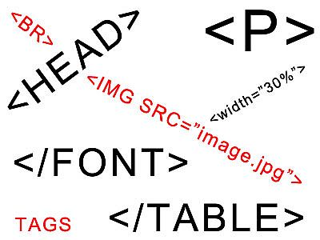

<!-- section start -->
<!-- attr: { id:'', class:'slide-title', showInPresentation:'True', hasScriptWrapper:'True', style:'font-size: 42px' } -->
# HTML Basics: Course Introduction
## Course Program, Evaluation, Resources

<div class="signature">
    <p class="signature-course">HTML Basics</p>
    <p class="signature-initiative">Telerik Software Academy</p>
    <a href="http://academy.telerik.com" class="signature-link">http://academy.telerik.com</a>
</div>

<!--  -->
<!--  -->


<!-- section start -->
<!-- attr: { id:'', class:'', showInPresentation:'True', hasScriptWrapper:'True', style:'font-size: 42px' } -->
# Table of Contents
- [HTML Course Curriculum](#/curriculum)
- [Evaluation](#/evaluation)
- [Learning Resources](#/resources)
  - [Required software](#/software)

<!--  -->
<!--  -->


<!-- section start -->
<!-- attr: { id:'curriculum', class:'slide-section', showInPresentation:'True', hasScriptWrapper:'True', style:'font-size: 42px' } -->
<!-- # <a id="curriculum"></a>HTML Course Curriculum
 -->


<!-- attr: { id:'', class:'', showInPresentation:'True', hasScriptWrapper:'True', style:'font-size: 42px' } -->
# What's Coming Next?
- HTML Introduction
  - Fundamental for web development
  - Start of the **Front-end track**
  - Lectures once a week
  - Test exam **after a month**
- The course exam?
  - **35 questions** for **45 minutes**
  - Telerik Academy Test System

<!--  -->


<!-- attr: { id:'', class:'', showInPresentation:'True', hasScriptWrapper:'False', style:'font-size: 42px' } -->
# Why HTML, CSS and JS?
- **HTML**, **CSS** and **JS** – the standard for web-based UI
  - Web-based applications are extremely popular
  - Run on **anything with a browser**
  - Many frameworks that produce **native applications** from HTML, CSS and JS
- **HTML** and **CSS** – evolving standards
- **JavaScript**
  - High-level scripting language, easy to use
  - The [**most widely used**](http://stackoverflow.com/research/developer-survey-2015) programming language
  - Runs on client and server
  - Has a bad history, but is a quite good language


<!-- attr: { id:'', class:'', showInPresentation:'True', hasScriptWrapper:'True', style:'font-size: 42px' } -->
# HTML Basics Program
- Web Development Fundamentals
- Introduction to HTML
- HTML Tables
- HTML Forms
- Semantic HTML
- **HTML Basics Test**

<!--  -->
<!--  -->
<!--  -->
<!--  -->
<!--  -->


<!-- section start -->
<!-- attr: { id:'evaluation', class:'slide-section', showInPresentation:'True', hasScriptWrapper:'True', style:'font-size: 42px' } -->
# <a id="evaluation"></a>Evaluation

<!--  -->
<!--  -->
<!--  -->


<!-- attr: { id:'', class:'', showInPresentation:'True', hasScriptWrapper:'True', style:'font-size: 42px' } -->
# HTML Basics - Evaluation
- Evaluation components
  - **Test** up to **75%**
  - **Homework** – **15%**
  - Homework **evaluation** – **5%**
    - 3 peer reviews per homework
  - **Attendance** in class – **5%**

<!--  -->


<!-- attr: { id:'', class:'', showInPresentation:'True', hasScriptWrapper:'False', style:'font-size: 40px' } -->
# HTML Basics Test – Sample Question
- You are given the following (exact) HTML code:

```html
<div>
	<p>This is\r\n
	multi-line
	text</p>
</div>
```

- What will the page text look like in a modern browser?
  <ul>
    <li>This is <br /> multi-line <br /> text
    <li>404 - not found</li>
    <li>This is multi-line text</li>
    <li class="fragment highlight-green">This is\r\n multi-line text</li>
  </ul>

<!-- attr: { id:'', class:'', showInPresentation:'True', hasScriptWrapper:'False', style:'font-size: 42px' } -->
# Homework Assignments
- Doing your homework is very important!
  - Programming can only be learned through **a lot of practice**!
- Homework assignments due few days after each lecture
  - No excuses for being late
  - Deadlines are final & enforced by the system</u>
- Submit homework through [telerikacademy.com](http://telerikacademy.com)

<!-- attr: { id:'', class:'', showInPresentation:'True', hasScriptWrapper:'False', style:'font-size: 42px' } -->
# Homework Peer Reviews
- Everyone will **get feedback** for their homework
- Everyone will **give feedback** for few random homework submissions
  - Students submit homework **anonymously**
    - Please exclude your name from the submissions!
  - For each homework submitted
    - Students **evaluate 3 random homeworks**
    - From the same topic, after the deadline
    - Give written feedback, at least 200 characters
    - Low-quality feedback &rarr; report for punishment


<!-- attr: { id:'', class:'', showInPresentation:'True', hasScriptWrapper:'True', style:'font-size: 40px' } -->
# Attendance in Class
  - We encourage live participation
  - Top performers throughout the years have always spent lots of time in the academy halls
- Register your presence @ barcode scanners
  - Last check-in is listed in your student profile
  - Scanners are next to the doors
  - Use Student ID Card
  - Check in+/- 30 min.before / after lecture starts

<!--  -->


<!-- attr: { id:'', class:'', showInPresentation:'True', hasScriptWrapper:'True', style:'font-size: 42px' } -->
# Pass / Excellence / Fail Criteria
  - Criteria for pass / pass with excellence / fail
  <br/><br/>
    - **Passwith excellence**
      - Very high exam results
      - or High total results
    - **Pass**
      - Average total results
    - **Fail**
      - Low total results or low exam results

<!--  -->
<!--  -->
<!--  -->


<!-- section start -->
<!-- attr: { id:'resources', class:'slide-section', showInPresentation:'True', hasScriptWrapper:'True', style:'font-size: 42px' } -->
# <a id="resources"></a>Additional Resources
## Optional resources for the course

<!--  -->
<!--  -->
<!--  -->
<!--  -->
<!--  -->
<!--  -->
<!--  -->
<!--  -->


<!-- attr: { id:'', class:'', showInPresentation:'True', hasScriptWrapper:'True', style:'font-size: 38px' } -->
# Additional Resources

- [Mozilla Developer Network](https://developer.mozilla.org/en-US/)
  - The most complete documentation of web standards
    - `HTML`, `CSS` and `JavaScript`
    - Supported features on different browsers and versions
- [Stack Overflow](http://stackoverflow.com/)
  - [Newest HTML questions](http://stackoverflow.com/questions/tagged/html)
  - [Newest CSS questions](http://stackoverflow.com/questions/tagged/css)
  - [Newest JavaScript questions](http://stackoverflow.com/questions/tagged/javascript)

<!-- attr: { id:'', class:'', showInPresentation:'True', hasScriptWrapper:'False', style:'font-size: 42px' } -->
# Course Web Site & Forums
- Register for the "Telerik Academy Forums":
  - http://telerikacademy.com/Forum/Category/27/HTML-CSS
  - Discuss the course exercises with your colleagues
  - Find solutions for the exercises
  - Share source code / discuss ideas
- The HTML Basics official web site:
    - [academy.telerik.com/student-courses/web-design-and-ui/html-fundamentals/about](http://academy.telerik.com/student-courses/web-design-and-ui/html-fundamentals/about )


<!-- attr: { id:'', class:'', showInPresentation:'True', hasScriptWrapper:'True', style:'font-size: 42px' } -->
<!-- # Telerik Integrated Learning System (TILS) -->
- The Telerik Integrated Learning System (TILS)
  - [www.telerikacademy.com](http://www.telerikacademy.com)
  - Important resource for all students
  - Homework submissions
  - Homework peer reviews
  - Presence cards with barcode
  - Reports about your results
- [telerikacademy.com/Courses/Courses/Details/324](http://telerikacademy.com/Courses/Courses/Details/324)


<!-- attr: { id:'software', class:'', showInPresentation:'True', hasScriptWrapper:'False', style:'font-size: 42px' } -->
# <a id="software"></a>Required Software
- Software needed for this course:
  - [Atom](https://atom.io/)
  - [Sublime Text 2/3](http://www.sublimetext.com/2)
  - [Notepad++](https://notepad-plus-plus.org/)
  - [VS Code](https://www.visualstudio.com/en-us/products/code-vs.aspx)
  - [Jetbrains WebStorm](https://www.jetbrains.com/webstorm/)
  - [Aptana Studio](http://www.aptana.com/)
  - Microsoft [Visual Studio 2013 or 2015](https://www.visualstudio.com/)
    - Visual Studio Community (free version of VS)
  - Any text editor that is convenient with you


<!-- section start  -->

<!-- attr: { id:'', class:'', showInPresentation:'True', hasScriptWrapper:'False', style:'font-size: 42px' } -->
# HTML Basics: Course Introduction

<!--  -->

<!-- attr: { id:'', class:'', showInPresentation:'True', hasScriptWrapper:'True', style:'' } -->
# Free Trainings @ Telerik Academy
- Web front-end track
    - [html.telerik.com](http://academy.telerik.com/student-courses/web-design-and-ui/about)
  - Telerik Software Academy
    - [academy.telerik.com](academy.telerik.com)
  - Telerik Academy @ Facebook
    - [facebook.com/TelerikAcademy](facebook.com/TelerikAcademy)
  - Telerik Academy Learning System
    - [telerikacademy.com](telerikacademy.com)
