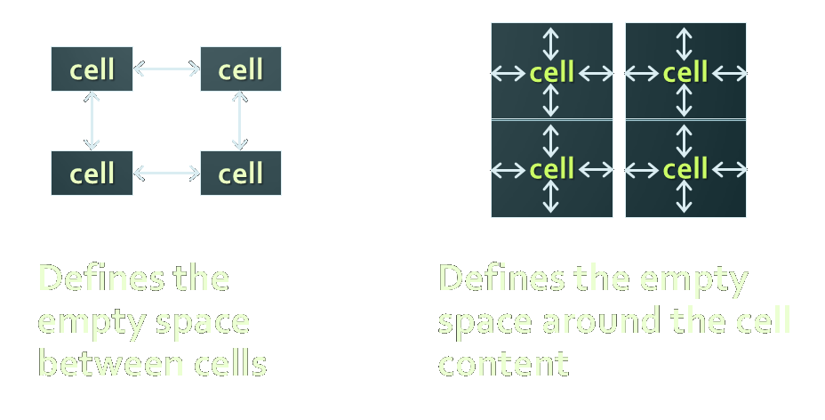
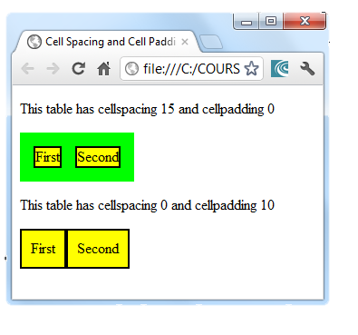
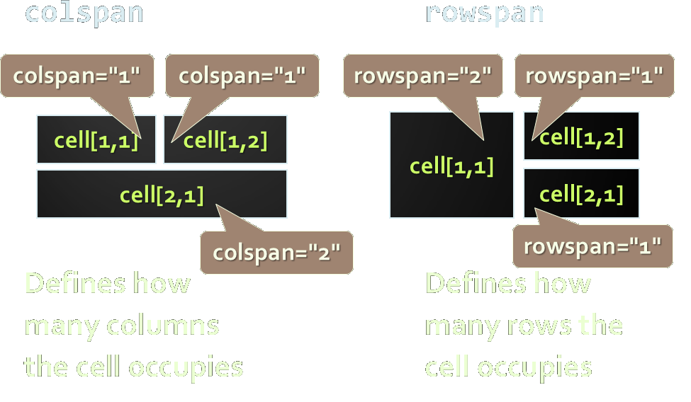

<!-- section start -->
<!-- attr: { class:'slide-title', showInPresentation:true, hasScriptWrapper:true, style:'font-size: 42px' } -->
# HTML Tables
<!--  -->
<!--  -->
<!--  -->
<!--  -->

<div class="signature">
    <p class="signature-course">HTML Basics</p>
    <p class="signature-initiative">Telerik Software Academy</p>
    <a href="https://telerikacademy.com" class="signature-link">https://telerikacademy.com</a>
</div>


<!-- section start -->
<!-- attr: { showInPresentation:true, hasScriptWrapper:true, style:'font-size: 42px' } -->
# Contents
- [HTML Tables](#/tables)
  - [Simple Tables](#/simpletables)
  - [Data cells and Header cells](#/headers)
  - [Complete HTML Tables](#/completetables)
- [Nested Tables](#/nestedtables)
- [Complex tables](#/comlextables)
  - [Cell Spacing and Padding](#/cells)
  - [Column and Row Span](#/spans)

<!--  -->


<!-- section start -->
<!-- attr: { class:'slide-section', showInPresentation:true, hasScriptWrapper:true, style:'font-size: 42px' } -->
<!-- # HTML Tables -->
<!--  -->
<!--  -->
<!--  -->


<!-- attr: { id:'tables', showInPresentation:true, hasScriptWrapper:true, style:'font-size: 42px' } -->
# <a id="tables"></a>HTML Tables
- Tables represent tabular data
  - A table consists of one or several rows
  - Each row has one or more columns
- Tables are comprised of several core tags:
  - `<table></table>`:  begin/end table definition
  - `<tr></tr>`: create a table row
  - `<td></td>`: create tabular data (cell)
- Tables should not be used for layout
  - Use CSS floats and positioning styles instead


<!-- attr: { id:'simpletables', showInPresentation:true, hasScriptWrapper:true, style:'font-size: 42px' } -->
# <a id="simpletables"></a>Simple HTML Tables – _Example_

```html
<table cellspacing="0" cellpadding="5">
  <tr>
    <td></td>
    <td><a href="lecture1.ppt">Lecture 1</a></td>
  </tr>
  <tr>
    <td></td>
    <td><a href="lecture2.ppt">Lecture 2</a></td>
  </tr>
  <tr>
    <td></td>
    <td>
      <a href="lecture2-demos.zip">Lecture 2 - Demos</a>
      </td>
  </tr>
</table>
```


<!-- attr: { class:'slide-section demo', showInPresentation:true, hasScriptWrapper:true, style:'font-size: 42px' } -->
<!-- # Simple HTML Tables -->
## [Demo](https://github.com/TelerikAcademy/HTML/tree/master/Topics/03.%20HTML-Tables/demos/1.%20Simple-tables.html)
<!--  -->
<!--  -->
<!--  -->
<!--  -->


<!-- attr: { id:'headers', showInPresentation:true, hasScriptWrapper:true, style:'font-size: 42px' } -->
# <a id="headers"></a>Data Cells and Header Cells
- Two kinds of cells in HTML tables
  - `Data` cells – containing the table data
  - `Header` cells – used for the column names or some more important cells
- Why two kinds of cells?
  - Used to `semantically` separate the cells

```html
<tr>
    <th>Full Name</th> <th>Mark</th>
</tr>
<tr>
    <td>Doncho Minkov</td> <td>Very good (5)</td>
</tr>
<tr>
    <td>Georgi Georgiev</td> <td>Excellent (6)</td>
</tr>
```


<!-- attr: { class:'slide-section demo', showInPresentation:true, hasScriptWrapper:true, style:'font-size: 42px' } -->
<!-- # Data and Header Cells -->
## [Demo](https://github.com/TelerikAcademy/HTML/tree/master/Topics/03.%20HTML-Tables/demos/2.%20Data-and-header-cells.html)
<!--  -->
<!--  -->


<!-- section start -->
<!-- attr: { id:'completetables', class:'slide-section', showInPresentation:true, hasScriptWrapper:true, style:'font-size: 42px' } -->
# <a id="completetables"></a>Complete HTML Tables
## With Header, Footer and Body
<!--  -->


<!-- attr: { showInPresentation:true, hasScriptWrapper:true, style:'font-size: 42px' } -->
# Complete HTML Tables
- Table rows split into three semantic sections: `header`, `body` and `footer`
  - `<thead>` denotes table header and contains `<th>` elements, instead of `<td>` elements
  - `<tbody>` denotes collection of table rows that contain the very data
  - `<tfoot>` denotes table footer but comes **BEFORE** the `<tbody>` tag
  - `<colgroup>` and `<col>` define columns (used to set column widths)


<!-- attr: { showInPresentation:true, hasScriptWrapper:true, style:'font-size: 42px' } -->
# Complete HTML Table: _Example_

```html
<table>
  <colgroup>
    <col style="width:100px" /><col />
  </colgroup>
  <thead>
    <tr><th>Column 1</th><th>Column 2</th></tr>
  </thead>
  <tfoot>
    <tr><td>Footer 1</td><td>Footer 2</td></tr>
  </tfoot>
  <tbody>
    <tr><td>Cell 1.1</td><td>Cell 1.2</td></tr>
    <tr><td>Cell 2.1</td><td>Cell 2.2</td></tr>
  </tbody>
</table>
```

<!-- attr: { showInPresentation:true, hasScriptWrapper:true, style:'font-size: 42px' } -->
# Complete HTML Table: _Example_

```html
<table>
  <colgroup>
    <col style="width:200px" /><col />
  </colgroup>
  <thead>
    <tr><th>Column 1</th><th>Column 2</th></tr>
  </thead>
  <tfoot>
    <tr><td>Footer 1</td><td>Footer 2</td></tr>
  </tfoot>
  <tbody>
    <tr><td>Cell 1.1</td><td>Cell 1.2</td></tr>
    <tr><td>Cell 2.1</td><td>Cell 2.2</td></tr>
  </tbody>
</table>
```

<div class="fragment balloon" style="top:59.88%; left:33.50%; width:46.72%">Although the footer is before the data in the code, it is displayed last</div>
<!--  -->


<!-- attr: { class:'slide-section demo', showInPresentation:true, hasScriptWrapper:true, style:'font-size: 42px' } -->
<!-- # Complete HTML Tables -->
## [Demo](https://github.com/TelerikAcademy/HTML/tree/master/Topics/03.%20HTML-Tables/demos/3.%20Complete-tables.html)
<!--  -->
<!--  -->

<!-- section start -->
<!-- attr: { id:'nestedtables', class:'slide-section', showInPresentation:true, hasScriptWrapper:true, style:'font-size: 42px' } -->
# <a id="nestedtables"></a>Nested Tables
## Tables in Tables in Tables in Tables…
<!--  -->
<!--  -->


<!-- attr: { showInPresentation:true, hasScriptWrapper:true, style:'font-size: 42px' } -->
# Nested Tables
- Table **cells** (`<td>`) can contain **nested** tables (tables within tables):

```html
<table>
  <tr>
    <td>Contact:</td>
    <td>
      <table>
        <tr>
          <td>First Name</td>
          <td>Last Name</td>
        </tr>
      </table>
    </td>
  </tr>
</table>
```

<!--  -->


<!-- attr: { class:'slide-section demo', showInPresentation:true, hasScriptWrapper:true, style:'font-size: 42px' } -->
<!-- # Nested Tables -->
## [Demo](https://github.com/TelerikAcademy/HTML/tree/master/Topics/03.%20HTML-Tables/demos/4.%20Nested-tables.html)
<!--  -->
<!--  -->
<!--  -->


<!-- section start -->
<!-- attr: { id:'comlextables', class:'slide-section', showInPresentation:true, hasScriptWrapper:true, style:'font-size: 42px' } -->
<!-- # <a id="comlextables"></a> Complex Tables
## With Padding, Spacing and Stuff -->
<!--  -->


<!-- attr: { id:'cells', showInPresentation:true, hasScriptWrapper:true, style:'font-size: 42px' } -->
# <a id="cells"></a> Cell Spacing and Padding

<div>
  <div class="balloon" style="top:20%;left:15%">cell spacing</div>
  <div class="balloon" style="top:20%;left:60%">cell padding</div>
</div>

<!--  -->


<!-- attr: { showInPresentation:true, hasScriptWrapper:true, style:'font-size: 42px' } -->
# Cell Spacing and Padding – _Example_

```html
<html>
  <head><title>Table Cells</title></head>
  <body>
    <table cellspacing="15" cellpadding="0">
      <tr>
          <td>First</td>
          <td>Second</td>
      </tr>
    </table>
    <br/>
    <table cellspacing="0" cellpadding="10">
      <tr>
          <td>First</td>
          <td>Second</td>
      </tr>
    </table>
  </body>
</html>
```


<!-- attr: { showInPresentation:true, hasScriptWrapper:true, style:'font-size: 42px' } -->
<!-- # Cell Spacing and Padding – _Example_ -->

```html
<html>
  <head><title>Table Cells</title></head>
  <body>
    <table cellspacing="15" cellpadding="0">
      <tr>
          <td>First</td>
          <td>Second</td>
      </tr>
    </table>
    <br/>
    <table cellspacing="0" cellpadding="10">
      <tr>
          <td>First</td>
          <td>Second</td>
      </tr>
    </table>
  </body>
</html>
```

<!--  -->


<!-- attr: { class:'slide-section demo', showInPresentation:true, hasScriptWrapper:true, style:'font-size: 42px' } -->
<!-- # Cell Spacing and Cell Padding -->
## [Demo](https://github.com/TelerikAcademy/HTML/tree/master/Topics/03.%20HTML-Tables/demos/5.%20Table-cells-spacing-padding.html)
<!--  -->
<!--  -->
<!--  -->


<!-- section start -->
<!-- attr: { id:'spans', class:'slide-section', showInPresentation:true, hasScriptWrapper:true, style:'font-size: 42px' } -->
# <a id="spans"></a>Row and Column Spans
## How to Make a Two-Cells Column or Row?
<!--  -->
<!--  -->
<!--  -->


<!-- attr: { showInPresentation:true, hasScriptWrapper:true, style:'font-size: 42px' } -->
<!-- # Column and Row Span -->
<!--  -->

<!-- attr: { showInPresentation:true, hasScriptWrapper:true, style:'font-size: 42px' } 
# Column and Row Span – _Example_ -->

```html
<table cellspacing="0">
  <tr class="1">
  	<td>Cell[1,1]</td>
  	<td colspan="2">Cell[2,1]</td>
  </tr>
  <tr class="2">
  	<td>Cell[1,2]</td>
  	<td rowspan="2">Cell[2,2]</td>
  	<td>Cell[3,2]</td>
  </tr>
  <tr class="3">
  	<td>Cell[1,3]</td>
  	<td>Cell[2,3]</td>
  </tr>
</table>
```

<!--  -->


<!-- attr: { class:'slide-section demo', showInPresentation:true, hasScriptWrapper:true, style:'font-size: 42px' } -->
<!-- # Row and Column Spans -->
## [Demo](https://github.com/TelerikAcademy/HTML/tree/master/Topics/03.%20HTML-Tables/demos/6.%20Table-colspan-rowspan.html)
<!--  -->


<!-- attr: { showInPresentation:true, hasScriptWrapper:true, style:'font-size: 42px' } -->
<!-- # HTML – Tables and Forms -->
<!-- ## Questions? -->

<!--  -->

<!-- attr: { showInPresentation:true, hasScriptWrapper:true, style:'' } -->
# Free Trainings @ Telerik Academy
- Web front-end track
    - [html.telerik.com](http://academy.telerik.com/student-courses/web-design-and-ui/about)
  - Telerik Software Academy
    - [telerikacademy.com](https://telerikacademy.com)
  - Telerik Academy @ Facebook
    - [facebook.com/TelerikAcademy](facebook.com/TelerikAcademy)
  - Telerik Academy Learning System
    - [telerikacademy.com](https://telerikacademy.com)
