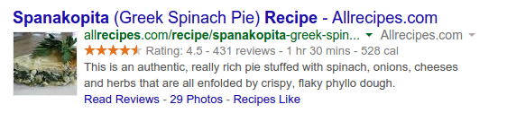

<!-- section start -->
<!-- attr: { id:'', class:'slide-title', showInPresentation:'True', hasScriptWrapper:'True', style:'font-size: 42px' } -->
# Semantic Web
## How to Use HTML Elements Properly?
<!--  -->
<!--  -->
<!--  -->


<!-- section start -->
<!-- attr: { id:'', class:'', showInPresentation:'True', hasScriptWrapper:'True', style:'font-size: 42px' } -->
# Table of Contents
- [Web Page](#/webpage)
  - [HTML, CSS and JavaScript](#/html)
- [The Semantic HTML](#/semantic)
- [HTML5 Semantic Tags](#/html5)
- [Other Semantics](#/other)
- [Accessibility](#/access)
- [Search Engine Optimization](#/seo)
- [Structured Data Markup](#/datamarkup)
<!--  -->


<!-- section start -->
<!-- attr: { id:'', class:'slide-section', showInPresentation:'True', hasScriptWrapper:'True', style:'font-size: 42px' } -->
<!-- # Web Page -->
<!--  -->


<!-- attr: { id:'webpage', class:'', showInPresentation:'True', hasScriptWrapper:'True', style:'font-size: 42px' } -->
# <a id="webpage"></a>The Elements of a Web Page
- A Web page consists of:
  - HTML markup
  - CSS rules
  - JavaScript code
    - JS libraries
  - Images
  - Other resources
    - Fonts, audio, video, Flash, Silverlight, etc…
<!--  -->


<!-- attr: { id:'html', class:'', showInPresentation:'True', hasScriptWrapper:'True', style:'font-size: 42px' } -->
# <a id="html"></a>The Elements of a Web Page: HTML Markup
- The HTML is used to define <br /> the **content** of a Web page
  - Not the layout
  - Not the decorations
- HTML's role is to present theinformation in a **meaningful** manner
  - Like a paper document
  - Define headers, paragraphs, textboxes, etc…
  - Not define size, color and/or positioning
<!--  -->


<!-- attr: { id:'', class:'', showInPresentation:'True', hasScriptWrapper:'True', style:'font-size: 42px' } -->
# The Elements of a Web Page: CSS Rules
- Cascading Style Sheets (**CSS**) is the way to make a Web page look pretty
  - Define **styling rules**
    - Fonts, colors, positioning, etc.
  - Define the layout of the elements
  - Define the presentation
- The CSS files are attached to a web page and the browser applies these styles to elements
<!--  -->


<!-- attr: { id:'', class:'', showInPresentation:'True', hasScriptWrapper:'True', style:'font-size: 42px' } -->
# The Elements of a Web Page: JavaScript Code
- **JavaScript** is the programming language for the Web
  - Makes the Web pages dynamic
  - Dynamically adding / removingHTML elements, applying styles, etc.
  - Modern JavaScript UI libraries provide UI components like dialog boxes, grids, tabs, etc.
- Like CSS the JavaScript files are attached to a web page
<!--  -->


<!-- attr: { id:'', class:'', showInPresentation:'True', hasScriptWrapper:'True', style:'font-size: 42px' } -->
# The Elements of a Web Page: Other Resources
- Other resources are needed for a Web page to run properly
  - Images, fonts (glyph icons), audio, video files
  - Flash / Silverlight / ActiveX objects
<!--  -->
<!--  -->
<!--  -->
<!--  -->
<!--  -->


<!-- section start -->
<!-- attr: { id:'', class:'slide-section', showInPresentation:'True', hasScriptWrapper:'True', style:'font-size: 42px' } -->
<!-- # The Semantic HTML -->
<!--  -->
<!--  -->


<!-- attr: { id:'semantic', class:'', showInPresentation:'True', hasScriptWrapper:'True', style:'font-size: 42px' } -->
# <a id="semantic"></a>Semantic HTML
- **Semantic** HTML is:
  - The use of HTML markup to reinforce the semantics of the information in Web pages
    - Make the content understandable for computers
  - Rather than merely to define its presentation
  - A kind of **metadata** about the HTML content
- Semantic HTML is processed by regular Web browsers and other user agents
  - CSS is used to suggest its presentation to human users
<!--  -->


<!-- attr: { id:'', class:'', showInPresentation:'True', hasScriptWrapper:'True', style:'font-size: 42px' } -->
# Why Use Semantic HTML?
- Semantic HTML is:
  - Easier to read by developers, parsers, bots, machines, AIs
  - A way to show the search engines the correct content
<!--  -->
<!--  -->
<!--  -->


<!-- attr: { id:'', class:'', showInPresentation:'True', hasScriptWrapper:'True', style:'font-size: 42px' } -->
# How To Write Semantic HTML?
- Just follow some guideline swhen creating a Web site
  - Use HTML5 semantic tags
    - **&#60;header&#62;**, **&#60;nav&#62;**, **&#60;section&#62;**, **&#60;article&#62;**, **&#60;aside&#62;**, **&#60;footer&#62;**
  - Use Headings when you need to structure the content into sub-headings
    - In increasing order, staring with **&#60;h1&#62;**
  - Do not use empty tags
    - Like a clearing **&#60;div&#62;**
<!--  -->


<!-- section start -->
<!-- attr: { id:'', class:'slide-section', showInPresentation:'True', hasScriptWrapper:'True', style:'font-size: 42px' } -->
<!-- # HTML5 Semantic Tags -->
<!--  -->


<!-- attr: { id:'', class:'', showInPresentation:'True', hasScriptWrapper:'True', style:'font-size: 42px' } -->
# HTML5 Semantic Tags
- HTML5 introduces **semantic structure tags**
  - Imagine the following site:
  - This is a common Web page structure <!-- .element: class="fragment balloon" style="top: 80%; left:31%" -->
    - Used in 90% of the web sites

<!--  -->


<!-- attr: { id:'', class:'', showInPresentation:'True', hasScriptWrapper:'True', style:'font-size: 42px' } -->
# HTML5 Semantic Tags
- This can be created using all kind of HTML elements
  - **&#60;div&#62;**, **&#60;span&#62;**, even **&#60;p&#62;**
  - Browsers will render invalid / wrong / pseudo valid HTML
- The correct way: use the HTML 5 semantic tags:

```html
<header> … </header>
<nav> … </nav>
<main> … </main>
<article> … </article>
<section> … </section>
<aside> … </aside>
<footer> … </footer>
```


<!-- attr: { id:'', class:'', showInPresentation:'True', hasScriptWrapper:'False', style:'font-size: 42px' } -->
# HTML5 Structure Tags
- **&#60;main&#62;**
  - Specifies the main content of a document (info)
  - There must not be more than one **&#60;main&#62;** element in a document
- **&#60;header&#62;**
  - Site header or section header or article header
  - Could include navigation (**&#60;nav&#62;**)
- **&#60;footer&#62;**
  - Site footer (sometime can be a section footer)
  - Providing author, copyright data, etc.


<!-- attr: { id:'', class:'', showInPresentation:'True', hasScriptWrapper:'False', style:'font-size: 42px' } -->
# HTML5 Structure Tags
- **&#60;nav&#62;**
  - Defines a set of navigation links.
  - E.g. site navigation (usually in the header)
- **&#60;aside&#62;**
  - Content slightly related to primary content
  - E.g. sidebar (usually on the left or on the right)
- **&#60;section&#62;**
  - Grouping of content usually with a heading, similar to chapters
  - Site section (e.g. news, comments, links, …)


<!-- attr: { id:'', class:'', showInPresentation:'True', hasScriptWrapper:'False', style:'font-size: 42px' } -->
# HTML5 Content Tags
- **&#60;article&#62;**
  - Independent content such as blog post or an article (e.g. news item)
- **&#60;details&#62;** + **&#60;summary&#62;**
  - Specifies additional details that the user can view or hide on demand (accordion-like widget)
- **&#60;time&#62;**
  - Specifies date / time (for a post / article / news)
- **&#60;mark&#62;**
  - Defines marked/highlighted text


<!-- attr: { id:'', class:'', showInPresentation:'True', hasScriptWrapper:'False', style:'font-size: 42px' } -->
# HTML5 Content Tags
- **&#60;figure&#62;**
  - Grouping stand-alone content (video or image)
  - Figure (a figure, e.g. inside an article)
- **&#60;figcaption&#62;**
  - A caption of a figure (inside the **&#60;figure&#62;** tag)
- **&#60;video&#62;** (info)
  - Video element (uses the built-in player)
- **&#60;audio&#62;** (info)
  - A standard for playing audio files (built-in player)


<!-- attr: { id:'', class:'', showInPresentation:'True', hasScriptWrapper:'True', style:'font-size: 42px' } -->
# HTML5 Content Tags
- **&#60;dialog&#62;**
  - Defines a dialog box or window
- **&#60;meter&#62;** / **&#60;progress&#62;**
  - Defines a scalar measurement within a <br /> known range (a gauge) or task progress
- **&#60;output&#62;**
  - Defines the result of a calculation
- **&#60;wbr&#62;**
  - Defines a possible line-break
<!--  -->
<!--  -->


<!-- section start -->
<!-- attr: { id:'', class:'slide-section', showInPresentation:'True', hasScriptWrapper:'True', style:'font-size: 42px' } -->
<!-- # Other Semantics
## Headings, ems, strongs -->
<!--  -->


<!-- attr: { id:'other', class:'', showInPresentation:'True', hasScriptWrapper:'False', style:'font-size: 42px' } -->
# <a id="other"></a>Other Semantics
- Headings
  - Always use headings (**&#60;h1&#62;** – **&#60;h6&#62;**) when you need a heading or title
    - Like in a MS Word document
    - Google uses it to mark important content
- Strong **&#60;strong&#62;** vs. Bold **&#60;b&#62;**
  - **&#60;b&#62;** does not mean anything
    - It just makes the text bolder
  - **&#60;strong&#62;** marks the text is "stronger" than the other, surrounding text


<!-- attr: { id:'', class:'', showInPresentation:'True', hasScriptWrapper:'False', style:'font-size: 42px' } -->
# Other Semantics
- Emphasis **&#60;em&#62;** vs. Italic **&#60;i&#62;**
  - Emphasis does not always mean, that the code should be italic
    - It could be bolder, italic and underlined
  - The styles for the emphasis text should be set with CSS
    - Not by HTML
- Old browsers (like IE6)?
  - Use Modernizr or HTML5shiv


<!-- section start -->
<!-- attr: { id:'', class:'slide-section', showInPresentation:'True', hasScriptWrapper:'True', style:'font-size: 42px' } -->
<!-- # Accessibility
## “A person’s a person,no matter how small” -->
<!--  -->


<!-- attr: { id:'access', class:'', showInPresentation:'True', hasScriptWrapper:'False', style:'font-size: 42px' } -->
# <a id="access"></a>Accessibility
- Craft content minding disabled users
  - Blind - include text equivalents of images, use labels in forms
  - Colorblind - do not convey information using color only
  - Visually impaired - avoid small font sizes
  - Epileptic - avoid flashing content (3Hz or more)
  - Physical disabilities - avoid functionality that relies only on the mouse or keyboard


<!-- attr: { id:'', class:'', showInPresentation:'True', hasScriptWrapper:'False', style:'font-size: 42px' } -->
# Accessibility
- Why implement accessibility?
  - Some accessibility features are mandatory for government sites in some countries (US, NL, SW)
  - “Everyone gets visited by a very important blind user, named Google”
  - Some SEO and accessibility considerations overlap


<!-- attr: { id:'', class:'', showInPresentation:'True', hasScriptWrapper:'False', style:'font-size: 42px' } -->
# Accessibility
- Standards
  - Web Content Accessibility Guidelines (WCAG) - http://www.w3.org/WAI/intro/wcag
  - Section 508 - http://www.section508.gov
- Tools
  - Will never replace manual testing, but may help
  - WAVE - http://wave.webaim.org/


<!-- section start -->
<!-- attr: { id:'', class:'slide-section', showInPresentation:'True', hasScriptWrapper:'True', style:'font-size: 42px' } -->
<!-- # Search Engine Optimization
## Getting ahead in search engines -->
<!--  -->
<!--  -->


<!-- attr: { id:'seo', class:'', showInPresentation:'True', hasScriptWrapper:'False', style:'font-size: 42px' } -->
# <a id="seo"></a>Search Engine Optimization
- Search engines use so-called “**crawlers**” to get the content of the page and index it
- The crawlers weigh the data on the page
  - **&#60;title&#62;**, **page URL** and **headings** have great weight
  - Links from highly valued pages to your page increase its value (Google **Page Rank**)
  - Add alt text to images
  - Use relevant keywords in the content and **&#60;meta&#62;** tags
- No SEO technique will replace good content


<!-- section start -->
<!-- attr: { id:'', class:'slide-section', showInPresentation:'True', hasScriptWrapper:'True', style:'font-size: 42px' } -->
<!-- # Structured Data Markup
## Annotate your content so machines can understand it -->
<!--  -->


<!-- attr: { id:'datamarkup', class:'', showInPresentation:'True', hasScriptWrapper:'True', style:'font-size: 40px' } -->
# <a id="datamarkup"></a>Structured Data Markup
- A standard way to annotate your content so machines can understand it
- Google (and other search engines) can
  - use that data to index your content better
  - present it more prominently in search results
    
  - Provide answers from the Knowledge Graph

<!--  -->


<!-- attr: { id:'', class:'', showInPresentation:'True', hasScriptWrapper:'False', style:'font-size: 42px' } -->
# Structured Data Markup
- Three alternative formats:
  - Microdata and RDFa
    - Define new HTML attributes
      - [More info](http://schema.org/docs/gs.html#microdata_how)
  - JSON-LD
    - Newest and simplest markup format
    - Embed a block of JSON data inside a script tag
      - [Specification](http://www.w3.org/TR/json-ld/)
      - [_Examples_](http://json-ld.org/playground/)


<!-- attr: { id:'', class:'', showInPresentation:'True', hasScriptWrapper:'False', style:'font-size: 42px' } -->
<!-- # Semantic Web -->
<!--  -->

<!-- attr: { id:'', class:'', showInPresentation:'True', hasScriptWrapper:'True', style:'' } -->
# Free Trainings @ Telerik Academy
- Fundamentals of C# ProgrammingTrack of Courses
    - [html.telerik.com](http://academy.telerik.com/student-courses/web-design-and-ui/about)
  - Telerik Software Academy
    - [academy.telerik.com](academy.telerik.com)
  - Telerik Academy @ Facebook
    - [facebook.com/TelerikAcademy](facebook.com/TelerikAcademy)
  - Telerik Academy Learning System
    - [telerikacademy.com](telerikacademy.com)
